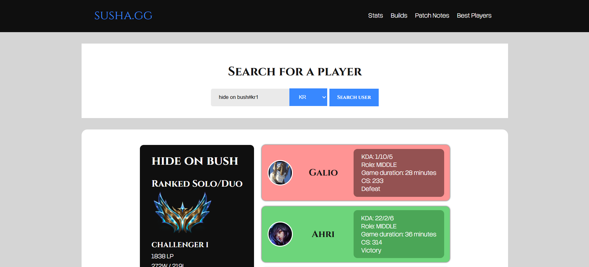
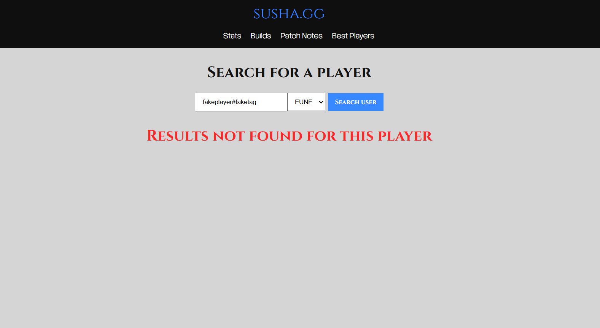

# susha.gg

susha.gg is a full-stack League of Legends stats app that lets users look up player data using the Riot Games API.

The frontend is built with React and TypeScript, while the backend uses Node.js and Express to handle API requests securely.

## Tech Stack

### Frontend
- React
- TypeScript
- Vite

### Backend
- Node.js
- Express.js

### APIs & Tools
- Riot Games API

## Features
```txt
- Search for League of Legends player data
- Retrieve live data from the Riot Games API
- Backend API layer to protect API keys
- Clean React + TypeScript frontend
- Simple full-stack project structure
```
## Project Structure

```
susha.gg/
├── backend/     # Node.js + Express backend
└── susha-gg/    # React + TypeScript frontend
Getting Started
```

1. Clone the repository
```git
git clone https://github.com/Lander2003/susha.gg.git
cd susha.gg
```

3. Install backend dependencies
```cmd
cd backend
npm install
```
Create a .env file and add your Riot Games API key:
```txt
RIOT_API_KEY=your_api_key_here
```
Start the backend:
```cmd
npm run dev
```
3. Install frontend dependencies

```cmd
cd ../susha-gg
npm install
npm run dev
```
About

This project was built to practice full-stack development with React, TypeScript, Node.js, and Express while working with a real external API.

## Screenshots



