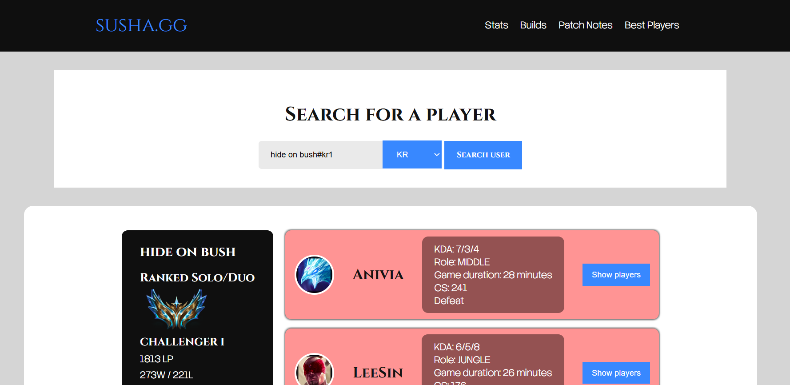
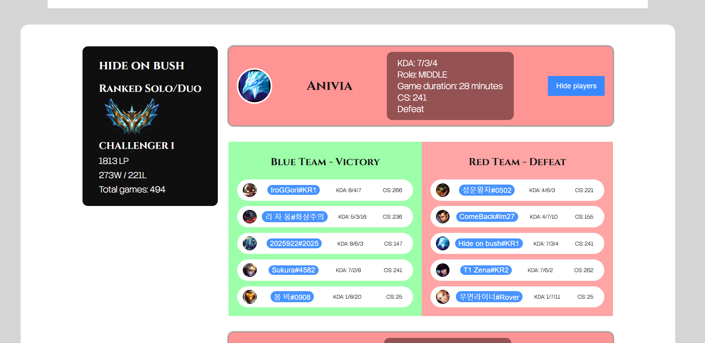
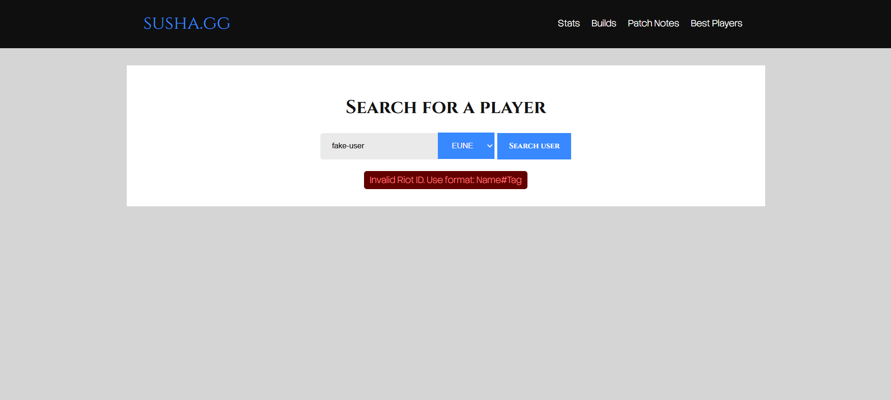

# susha.gg

**susha.gg** is a League of Legends match history web application built with React, TypeScript, Node.js, and Express.
Users can search for a Riot player by Riot ID, view ranked solo queue information, inspect recent matches, expand each match to see all players divided by team, and click any player inside a match to search their profile.

## Live Demo

Frontend: https://susha-gg.vercel.app
Backend API: https://susha-gg.onrender.com

> Note: The backend is hosted on Render’s free tier, so the first request may take a few seconds if the server has been inactive.

## Features

* Search players by Riot ID, for example `Hide on bush#KR1`
* Select supported regions
* Display ranked solo queue information
* Display recent match history
* Show champion, KDA, role, CS, game duration, and match result
* Expand each match to view all participants
* Divide match participants by Blue Team and Red Team
* Display team-level Victory / Defeat result
* Click any player inside a match to search their account
* Load more matches with pagination
* Separate backend route for loading additional matches without repeating unnecessary account lookups
* About Me page with personal links
* Responsive React frontend
* Deployed frontend and backend

## Tech Stack

### Frontend

* React
* TypeScript
* Vite
* React Router
* CSS
* Vercel deployment

### Backend

* Node.js
* Express.js
* TypeScript
* Riot Games API
* Render deployment

### Security / Production Improvements

* Riot API key stored only on the backend
* Environment variables for frontend and backend configuration
* CORS restricted to allowed frontend origins
* Helmet security headers
* Rate limiting for API protection
* Input validation for Riot ID and region
* Separate `/getMatches` route for pagination efficiency
* No Riot API key exposed to the browser

## Project Structure

```txt
susha.gg/
├── frontend/
│   ├── src/
│   │   ├── api/
│   │   │   └── searchPlayer.ts
│   │   ├── components/
│   │   │   ├── AboutMe.tsx
│   │   │   ├── Content.tsx
│   │   │   ├── Navbar.tsx
│   │   │   ├── RankedSoloCard.tsx
│   │   │   └── Search.tsx
│   │   ├── App.tsx
│   │   └── main.tsx
│   ├── public/
│   ├── package.json
│   └── vite.config.ts
│
├── backend/
│   ├── server.ts
│   ├── getSimplifiedMatches.ts
│   ├── package.json
│   └── tsconfig.json
```

## API Routes

### `GET /getPlayer`

Fetches player account data, ranked solo queue data, and the first set of recent matches.

Example:

```txt
/getPlayer?gameid=Hide%20on%20bush%23KR1&region=KR
```

Returns:

* Player Riot ID
* Region
* PUUID
* Ranked solo queue data
* First page of simplified match data
* Pagination metadata

### `GET /getMatches`

Fetches additional matches for an already searched player using their PUUID.

Example:

```txt
/getMatches?puuid=PLAYER_PUUID&region=KR&start=5&count=5
```

Returns:

* Additional simplified matches
* Updated pagination metadata

This route avoids repeating unnecessary Riot account and ranked-data requests when loading more matches.

## Environment Variables

### Frontend `.env`

```env
VITE_API_URL=http://localhost:3000
```

For production:

```env
VITE_API_URL=https://susha-gg.onrender.com
```

### Backend `.env`

```env
RIOT_API_KEY=your_riot_api_key
```

The Riot API key must only exist on the backend.

## Running Locally

### 1. Clone the repository

```bash
git clone https://github.com/Lander2003/susha.gg.git
cd susha.gg
```

### 2. Run the backend

```bash
cd backend
npm install
npm run dev
```

The backend runs on:

```txt
http://localhost:3000
```

### 3. Run the frontend

Open a second terminal:

```bash
cd frontend
npm install
npm run dev
```

The frontend runs on:

```txt
http://localhost:5173
```

## Build Commands

### Frontend

```bash
npm run build
```

### Backend

```bash
npm run build
npm start
```

## Deployment

### Frontend

The frontend is deployed on Vercel.

Vercel environment variable:

```env
VITE_API_URL=https://susha-gg.onrender.com
```

### Backend

The backend is deployed on Render.

Render environment variable:

```env
RIOT_API_KEY=your_riot_api_key
```

Render build command:

```bash
npm install && npm run build
```

Render start command:

```bash
npm start
```

## What I Learned

While building this project, I practiced:

* Building a full-stack TypeScript application
* Working with an external API
* Structuring Express routes
* Protecting API keys with backend-only environment variables
* Handling pagination efficiently
* Implementing route-based navigation with React Router
* Managing frontend state across multiple components
* Deploying a separated frontend and backend
* Using production-focused middleware such as Helmet, CORS, and rate limiting

## Future Improvements

* Add MongoDB caching for Riot API responses
* Add user accounts and saved favorite players
* Add better loading and error UI
* Add queue type labels instead of raw queue IDs
* Add champion/item/rune details
* Add Docker support for the backend
* Add automated tests
* Improve mobile responsiveness
* Add custom domain

## Author

Built by Luka Susha Mochevikj.

* GitHub: https://github.com/Lander2003
* LinkedIn: https://www.linkedin.com/in/luka-susha

## Screenshots




