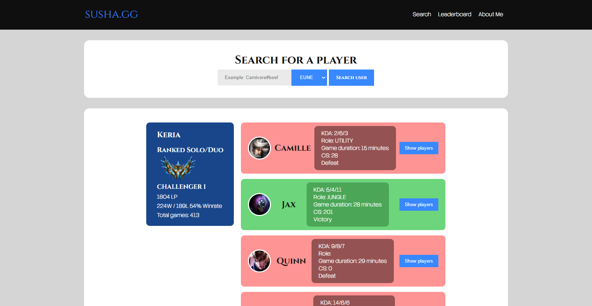
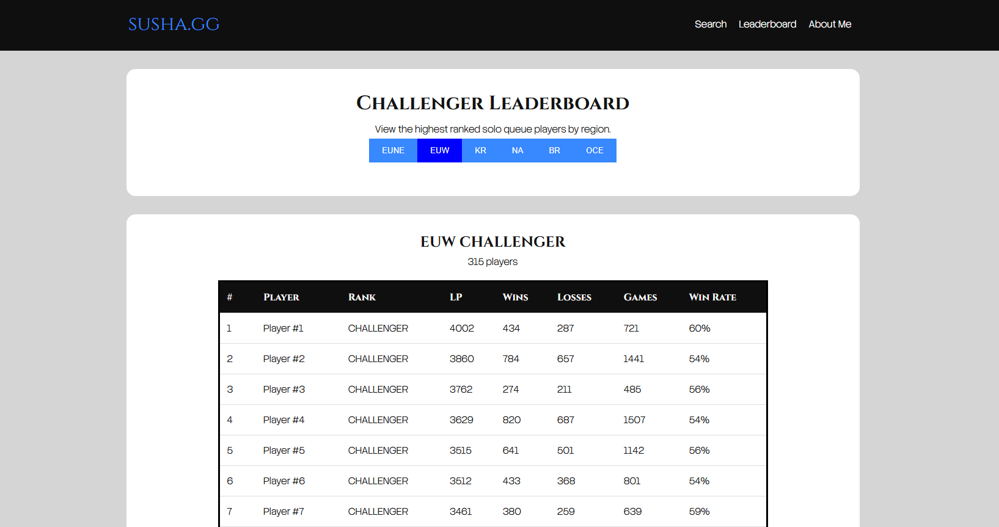
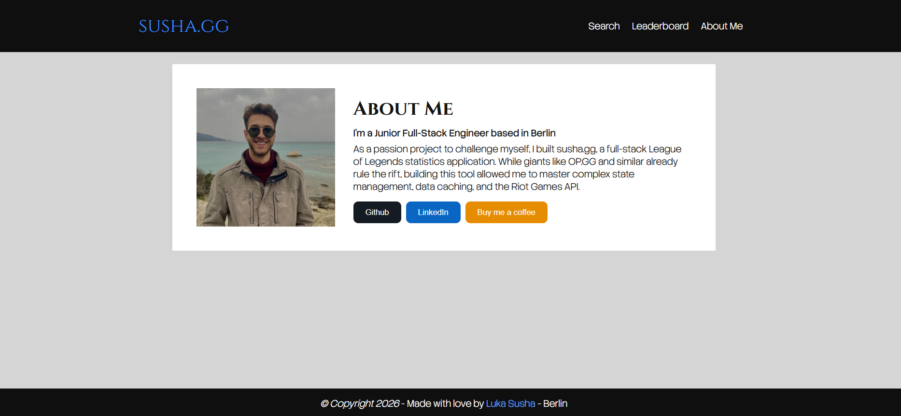

# susha.gg

A full-stack League of Legends player lookup and match history web application built with React, TypeScript, Node.js, Express, and the Riot Games API.

Live site: https://susha-gg.vercel.app
Backend API: https://susha-gg.onrender.com

## Overview

susha.gg allows users to search for a League of Legends player by Riot ID and region, view ranked solo queue information, inspect recent match history, expand individual matches to see all participants, and browse a regional Challenger leaderboard.

The project was built as a full-stack application with a strong focus on clean API design, backend security, Riot API integration, caching, rate limiting, and responsive frontend UI.

## Features

* Search players by Riot ID and region
* Display ranked solo queue data
* View recent match history
* Expand matches to inspect all participants
* Navigate between players from match history
* Regional Challenger leaderboard
* Leaderboard pagination
* In-memory caching for leaderboard data
* In-memory caching for match details
* Backend rate limiting to protect Riot API usage
* Secure environment variable handling
* Production frontend and backend deployments

## Tech Stack

### Frontend

* React
* TypeScript
* Vite
* React Router
* CSS
* Vercel deployment

### Backend

* Node.js
* Express.js
* TypeScript
* Riot Games API
* Helmet
* CORS
* Express Rate Limit
* In-memory caching
* Render deployment

## Riot APIs Used

* Riot Account API
* League API
* Match API

## Architecture

```txt
Frontend React App
        |
        | HTTP requests
        v
Express TypeScript Backend
        |
        | Secure Riot API requests
        v
Riot Games API
```

The Riot API key is stored only on the backend and is never exposed to the browser.

## API Routes

### `GET /getPlayer`

Fetches player account data, ranked solo queue information, and recent simplified matches.

Example query:

```txt
/getPlayer?gameid=Name%23Tag&region=EUW
```

### `GET /getMatches`

Fetches additional paginated match history for a player.

Example query:

```txt
/getMatches?puuid=PLAYER_PUUID&region=EUW&start=5&count=5
```

### `GET /leaderboard`

Fetches a regional Challenger solo queue leaderboard.

Example query:

```txt
/leaderboard?region=EUW&start=0&count=25
```

## Performance and Security

The backend includes several production-focused improvements:

* Riot API key stored securely in backend environment variables
* CORS restricted to allowed frontend origins
* Helmet middleware for safer HTTP headers
* Global and route-specific rate limiting
* Query parameter validation
* In-memory leaderboard caching
* In-memory match detail caching
* Request size limiting
* Generic error responses to avoid leaking sensitive details

Caching helps reduce repeated Riot API calls and protects the app from unnecessary rate limit usage.

## Local Development

### Prerequisites

* Node.js
* Riot Games API key

### Backend Setup

```bash
cd backend
npm install
```

Create a `.env` file:

```env
RIOT_API_KEY=your_riot_api_key
```

Start the backend:

```bash
npm run dev
```

The backend runs locally on:

```txt
http://localhost:3000
```

### Frontend Setup

```bash
cd frontend
npm install
```

Create a `.env` file:

```env
VITE_API_URL=http://localhost:3000
```

Start the frontend:

```bash
npm run dev
```

The frontend runs locally on:

```txt
http://localhost:5173
```

## Production Environment Variables

### Backend

```env
RIOT_API_KEY=your_riot_api_key
```

### Frontend

```env
VITE_API_URL=https://susha-gg.onrender.com
```

## Project Structure

```txt
susha.gg/
  backend/
    server.ts
    getSimplifiedMatches.ts
    getLeaderboard.ts
    cache.ts
  frontend/
    src/
      api/
      components/
      assets/
      App.tsx
      main.tsx
```

## What I Learned

This project helped me practice and improve:

* Full-stack TypeScript development
* REST API design
* Riot Games API integration
* Backend security best practices
* Rate limiting and API abuse protection
* Caching strategies for external API data
* React Router navigation
* State management in React
* Frontend/backend deployment workflows
* Environment variable management

## Future Improvements

* Persistent caching with Redis or a database
* Stronger schema validation with Zod
* Improved mobile leaderboard layout
* More detailed player statistics
* Champion images and role icons in leaderboard views
* Background refresh for cached data
* Better error and loading states

## Author

Built by Luka Susha Mochevikj.

GitHub: https://github.com/Lander2003
LinkedIn: https://www.linkedin.com/in/luka-susha

## Screenshots




